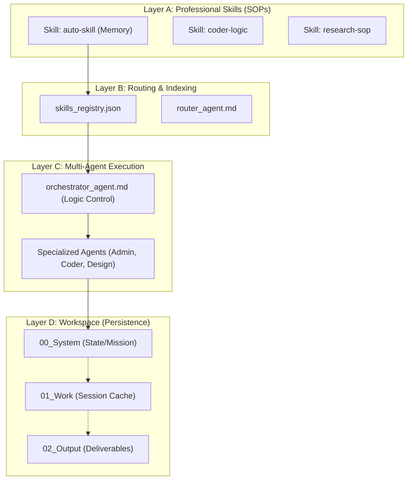
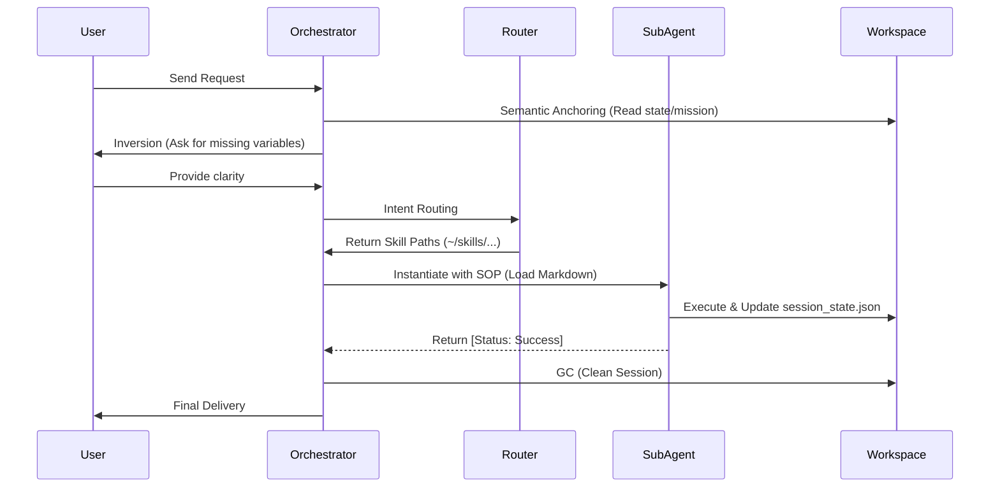

# MOSA (Markdown-Oriented Skill Architecture) 🚀

> **Version**: 2.1 (Hardened) | **Philosophy**: Logic over Payload | **Language**: Bilingual (ZH/EN)

MOSA is a high-level orchestration framework designed for agentic AI workflows. It decouples **"What to do"** (Professional Skills/SOPs in Markdown) from **"Who does it"** (Specialized Agents/Workflows).

By treating every professional capability as an "Atomic Skill" defined in Markdown, MOSA ensures that AI agents remain lightweight, deterministic, and highly portable across different workspaces.

---

## 🏛 Architecture: The 4-Layer Model

MOSA is structured into four distinct layers to ensure separation of concerns and system stability.



- **Layer A (Skills)**: The "Brain Tissue". Markdown files containing procedural knowledge, rules, and examples.
- **Layer B (Routing)**: The "Neural Paths". Maps user intent to specific Skill files using keywords and metadata.
- **Layer C (Execution)**: The "Muscles". Dynamic agents that load Skills into context as needed.
- **Layer D (Workspace)**: The "Ground". Standardized directory structure that provides "Semantic Anchoring" and prevents context drift.

---

## 🔄 Task Lifecycle: The Execution Loop

Every mission in MOSA follows a strict protocol to ensure high-quality output and context protection.



---

## 🛡 Core Principles

1. **Protocol-First (Constitution)**: All actions are governed by `GEMINI.md`. If it's not in the protocol, don't do it.
2. **Atomic Decomposition**: Large tasks are broken down into "Atomic Actions" before any code is written.
3. **Semantic Anchoring**: No turn starts without reading the "Ground Truth" (`prompt_stack.md`).
4. **Context Isolation**: No data leak between sibling projects. Every workspace is a silo.

---

## 🚀 Getting Started

### 1. Installation
Clone this repository into your AI's root search path (e.g., `~/.gemini/antigravity/`).

### 2. Scaffold a New Project
Copy the `templates/` folder to your new project directory:
```bash
cp -r templates/ my-new-project/
```

### 3. Initialize
Point your AI to the new directory and ask it to "Initialize MOSA". It will read `00_System/prompt_stack.md` and begin the mission.

---

## 📄 License
This project is licensed under the MIT License - see the [LICENSE](LICENSE) file for details.

---

## 🤝 Contributing
MOSA is built on the principle of "Self-Evolution". If you find a new best practice, record it using `auto-skill` and submit a Pull Request.
Credit to: Toolsai[https://github.com/Toolsai/auto-skill]
---
*Powered by DeepMind Advanced Agentic Coding Logic.*
