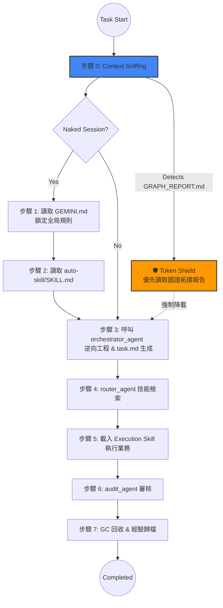

# 🪐 MOSA Framework (Markdown-Oriented Skill Architecture)

**MOSA (Markdown-Oriented Skill Architecture)** 是一個專為大語言模型 (LLM) 與 Agentic Coding Assistant 設計的解耦型、極致輕量的軟體工程工作流框架。

它的核心精神是以 Markdown 為原生靈魂，透過 **Pointers Only (僅存指標)** 哲學與最新的 **Graphify 拓撲感知** 能力，徹底解決 AI 助手在處理龐大庫存代碼時常遇到的「上下文漂移 (Context Drift)」與「Token 無效耗損」痛點。

---

## ✨ 核心設計哲學

1. **Markdown-Oriented**：所有法則、技能 (Skills) 與短期狀態追蹤皆使用格式規範的 Markdown。利用自然語言友好的格式，讓 AI 原生讀懂。
2. **Pointers Only (指針隔離化)**：絕不將原始碼全量寫入狀態表。各 Agent 之間的參數傳遞僅使用檔案的絕對路徑 (Pointers)。
3. **Graph Topology (拓撲感知)**：整合 Graphify，以 300 Token 的圖譜報告取代 30,000 Token 的茫然盲探，提供高達 **71.5x 的架構閱讀壓縮率**。

---

## 🏛 架構分層 (The 4 Layers of MOSA)

MOSA 透過嚴格的分層將任務意圖與具體邏輯徹底解耦：

*   **Layer A: 系統與協議 (Protocols)**  — 本體位於 `~/.gemini/GEMINI.md`，定義所有 Agent 必須遵守的憲法、狀態傳遞守則與統一啟動序列。
*   **Layer B: 記憶與認知 (Memory)**  — 使用 `00_System/prompt_stack.md` 作為專案長效記憶錨點，並透過輕量化索引構建技術認知倉庫。
*   **Layer C: 執行個體 (Agents)**  — 純 SOP 執行的技能，放置於 `skills/` 與 `workflows/` 下，由 Orchestrator 與 Router 分發，做到寫放分離。
*   **Layer D: 工作空間 (Workspace)** — 嚴格限制在專案的 Sibling 範圍內 (`00_System`, `01_Work`, `02_Output`)運作，保證專案間的干擾歸零。

---

## 🔄 核心運作邏輯 (MOSA Lifecycle)

### 統一啟動序列 (7-Step Sequence)

MOSA 保證每一次互動都能收斂回統一的出發點，不論是否發生上下文記憶丟失 (Naked Session)。

### 🛡️ Token Shield (Graphify 增強)
在 v2.4 版本之後，MOSA 正式內建圖譜感知能力。在 Step 0 Context Sniffing 若偵測到 `graphify-out/GRAPH_REPORT.md` 或是 `AGENTS.md` 規則護盾，Agent 將**被強制禁止**對目錄進行 `grep` 全域暴力掃描。這使得 Agent 能夠瞬間鎖定「市中心 (God nodes)」而不再是盲人摸象。

---

## 🛠 內建核心技能 (Core Skills)

除了常規自動化擴充，MOSA 出廠自帶維護框架自身完整性的工具鏈：

### 1. `mosa-harmonizer` (大一統協調員)
MOSA 的神經中樞與自體審計員。負責底層的：
*   **框架純度掃描**：排查系統內是否出現破壞可移植性的硬編碼絕對路徑 (`C:\Users\...`)。
*   **拓撲衝突偵測**：主動調用建圖工具，利用 JSON 追跡剔除未註冊 (Orphan nodes) 或邏輯相互耦合的越界技能。

### 2. `mosa-graph-builder` (拓撲知識庫構建器)
MOSA 應對未知巨型 codebase 的殺手鐧 (Discovery Agent)。
*   **主動探勘**：對大型資料夾運行結構建立。
*   **佈設護盾**：建置成功後自動在該 Sandbox 根目錄注入 `AGENTS.md` 護盾，強迫未來的 Agent 對該區域進入「低算力拓撲導航模式」。

---

## 📂 工作空間沙盒化 (Workspace Sandboxing)

每個開發專案需自主具備獨立的三段式隔離環境：

| 資料夾 | 用途規範 | 內容物範例 |
| :--- | :--- | :--- |
| `00_System/` | 長期指針錨點與框架狀態鎖定 | `prompt_stack.md`, `state.json` |
| `01_Work/` | 進行中的任務沙盒與繁雜源碼 | `session_state.json`, `src/` |
| `02_Output/` | 封裝成品與跨回合的靜態歸檔 | `.zip`, `Archive/` |

> [!WARNING]
> \*\*嚴格的 Sibling 隔離\*\*：Agent 被規定必須從當前觸發的游標/活躍文檔向上搜尋，以最近的 `00_System` 來決定 Workspace Root。嚴禁任何 Agent 在未授權狀況下跨越資料夾修改或讀取資料。

---

## 📜 審計觸發條件 (Audit Triggers)

為確保程式碼品質不會因為 Token 壓縮而犧牲，在執行循環階段若觸及以下條件，將強制攔截並呼叫 `audit_agent` (Step 6)：

- [x] 單次任務包含 ≥5 個檔案的實體寫入操作。
- [x] 任務被標記為 `[Critical]` 或涉及資安、合規數據。
- [x] 用戶直接於 Prompt 中明確要求。
- [x] Sub-Agent 在執行期間連續返回大於二次 (2) `[Status: Fail]`。

---

*“Simplicity is the ultimate sophistication. Context window is a finite resource.” — The MOSA Protocol*
