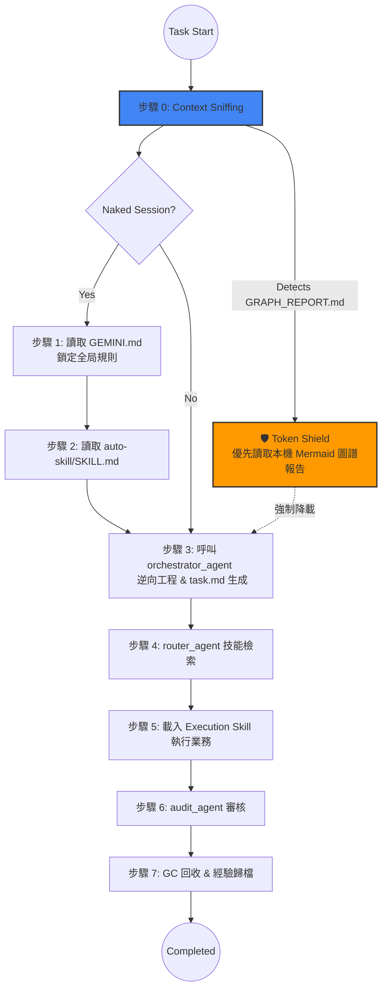

# 🪐 MOSA Framework (Markdown-Oriented Skill Architecture)

**MOSA (Markdown-Oriented Skill Architecture)** 是一個專為大語言模型 (LLM) 與 Agentic Coding Assistant 設計的解耦型、極致輕量的軟體工程工作流框架。

它的核心精神是以 **Markdown 為原生靈魂**，透過 **Pointers Only (僅存指標)** 哲學與首創的 **免 LLM 原生拓撲感知能力 (Native Mermaid Topology)**，徹底解決 AI 助手在處理龐大庫存代碼時常遇到的「上下文漂移 (Context Drift)」與「Token 無效燃燒」痛點。

---

## ✨ 核心設計哲學

1. **Markdown-Oriented**：所有法則、技能 (Skills)、記憶堆疊與狀態追蹤皆使用嚴格規範的 Markdown 設計。利用自然語言與標籤格式，讓 AI 原生直覺秒懂。
2. **Pointers Only (指針隔離化)**：絕不將原始碼全量寫入狀態表。各 Agent 之間的參數與報告傳遞，僅使用檔案的絕對路徑 (Pointers)。
3. **Zero-Cost Topology (零成本圖譜感知)**：不依賴昂貴且拖慢速度的外部 API 爬蟲。在未知專案啟動時，框架內的特種 Agent 會進行局部目錄遍歷，純手工寫出包含 Mermaid 語法的架構圖 (`GRAPH_REPORT.md`)，達成 **71x 以上的閱讀壓縮率**。

---

## 🏛 架構分層 (The 4 Layers of MOSA)

MOSA 透過嚴格的分層將任務意圖與具體邏輯徹底解耦：

*   **Layer A: 系統與協議 (Protocols)**  — 本體位於 `GEMINI.md`，定義所有 Agent 必須遵守的憲法、狀態傳遞守則與統一啟動序列。
*   **Layer B: 記憶與認知 (Memory)**  — 使用 `00_System/prompt_stack.md` 作為專案長效記憶錨點，防止失憶。
*   **Layer C: 執行個體 (Agents)**  — 純 SOP 執行的技能，放置於 `skills/` 與 `workflows/` 下，由 Orchestrator 進行任務解構與分發，實現寫放分離。
*   **Layer D: 工作空間 (Workspace)** — 嚴格限制在專案的 Sibling 範圍內 (`00_System`, `01_Work`, `02_Output`) 運作，專案間干擾物理歸零。

---

## 🔄 核心運作邏輯 (MOSA Lifecycle)

### 統一啟動序列 (7-Step Sequence)

MOSA 保證每一次互動都能收斂回統一的起點，不論是否發生上下文的記憶丟失 (Naked Session)。

### 🛡️ Token Shield (原生 Token 護盾)
這正是 MOSA 最引以為傲的防線。在 Step 0 (Context Sniffing) 階段，若目標目錄存在 `graphify-out/GRAPH_REPORT.md` 或 `AGENTS.md` 規則護盾，所有 Agent 將**被強制禁止**對目錄進行 `grep` 全域暴力掃描。AI 會優先讀取該份 Mermaid 拓撲報告，瞬間鎖定「大腦中樞 (God nodes)」，從而將原本可能需要 3 萬 Token 才能摸清的架構，壓縮到只有 300 Token 內的清晰鳥瞰。

---

## 🛠 內建核心技能 (Core Skills)

除了常規的業務擴充，MOSA 出廠即自帶維護框架自身完整性的工具鏈：

### 1. `mosa-graph-builder` (純淨拓撲知識庫構建器)
這是 MOSA 應對未知巨型 codebase 的首發探勘尖兵 (Discovery Agent)。
*   **本機探勘 (Zero-API)**：純粹依靠 Agent 自體的 `list_dir` 能力去分析目標資料夾層級，無需呼叫外部 LLM 爬蟲，零消耗。
*   **Mermaid 產出**：依據資料特徵判定 God Nodes，並手寫優雅的 Markdown `mermaid` 圖譜。
*   **佈設護盾**：建制成功後，自動於根目錄注入 `AGENTS.md` 護盾，確保之後接手的所有 Agent 遵循圖譜導航模式。

### 2. `mosa-harmonizer` (大一統審計協調員)
MOSA 的神經中樞與自體審計員。
*   **純度與衝突掃描**：強制排查硬編碼路徑以及技能呼叫異常。
*   **圖譜結合**：主動調閱 `mosa-graph-builder` 產出的框架圖譜，剔除未註冊的 Orphan nodes 及邏輯越界技能。

---

## 📂 工作空間沙盒化 (Workspace Sandboxing)

每個開發專案需自主具備獨立的三段式隔離環境：

| 資料夾 | 用途規範 | 內容物範例 |
| :--- | :--- | :--- |
| `00_System/` | 長期指針錨點與框架狀態鎖定 | `prompt_stack.md`, `state.json` |
| `01_Work/` | 進行中的任務沙盒與繁雜源碼 | `session_state.json`, `src/` |
| `02_Output/` | 封裝成品與跨回合的靜態歸檔 | `.zip`, `Archive/` |

> [!WARNING]
> \*\*嚴格的 Sibling 隔離\*\*：不論執行何種任務，Agent 被規定必須從當前活躍文檔向上搜尋 `00_System` 來決定 Workspace Root。嚴禁任何 Agent 在未授權狀況跨越資料夾修改或讀取資料。

---

## 📜 審計觸發條件 (Audit Triggers)

為了不在極致的 Token 壓縮中犧牲了程式安全性，任務若觸發下列條件，將強制呼叫 `audit_agent` 進入 Step 6 行為審查：

- [x] 單次任務包含 ≥5 個檔案的實體寫入操作。
- [x] 任務被標記為 `[Critical]` 或涉及資安、金融、合規數據。
- [x] 用戶直接於對話中主動要求審核。
- [x] 任何 Sub-Agent 於執行期間連續返回大於二次 (2) 的 `[Status: Fail]` 失敗狀態。

---

*“Simplicity is the ultimate sophistication. Context window is a finite resource.” — The MOSA Protocol*
