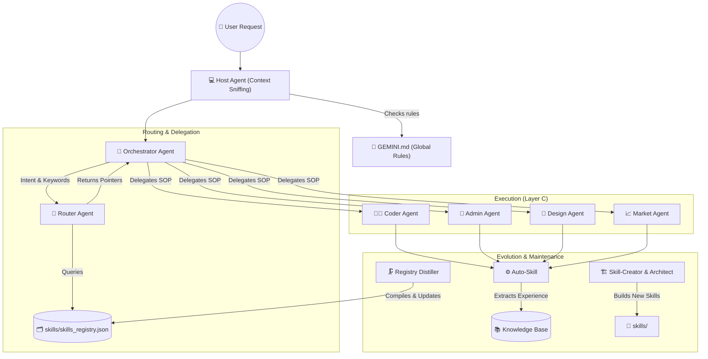

<div align="center">
  <h1>✨ MOSA Framework</h1>
  <p><strong>Markdown-Oriented Skill Architecture</strong></p>
  <p><em>The ultimate, token-efficient, context-aware framework for scaling autonomous AI agents.</em></p>
</div>

---

## 🚀 What is MOSA?

**MOSA (Markdown-Oriented Skill Architecture)** is a paradigm-shifting orchestration framework designed to run multi-agent, context-heavy AI systems efficiently.

By treating agents as pure "SOP Execution Machines" and passing only **pointers** (file paths) instead of raw data, MOSA drastically reduces token bloat while scaling infinite capabilities through modular Markdown skills.

---

## 🧩 The MOSA Workflow (Diagram)

Below is the execution topology and how the different components interact within the MOSA ecosystem.


```mermaid
graph TD
    User(("🧑 User Request")) --> Host["💻 Host Agent (Context Sniffing)"]
    Host -- "Checks rules" --> GEMINI["📜 GEMINI.md (Global Rules)"]
    Host --> Orch["🧠 Orchestrator Agent"]
    
    subgraph Routing_and_Delegation ["Routing & Delegation"]
        Orch -- "Intent & Keywords" --> Router["🧭 Router Agent"]
        Router -- "Queries" --> Registry[("🗂️ skills/skills_registry.json")]
        Router -- "Returns Pointers" --> Orch
    end

    subgraph Execution_Layer_C ["Execution (Layer C)"]
        Orch -- "Delegates SOP" --> Coder["👨‍💻 Coder Agent"]
        Orch -- "Delegates SOP" --> Admin["💼 Admin Agent"]
        Orch -- "Delegates SOP" --> Design["🎨 Design Agent"]
        Orch -- "Delegates SOP" --> Market["📈 Market Agent"]
    end
    
    subgraph Evolution_and_Maintenance ["Evolution & Maintenance"]
        Auto["⚙️ Auto-Skill"] -- "Extracts Experience" --> KB[("📚 Knowledge Base")]
        Creator["🏗️ Skill-Creator & Architect"] -- "Builds New Skills" --> SkillsDir["📂 skills/"]
        Distiller["🗜️ Registry Distiller"] -- "Compiles & Updates" --> Registry
    end

    Coder & Admin & Design & Market --> Auto
```

---

## 🔍 Step-by-Step Lifecycle: From Input to Output

MOSA works via a strict, multi-layer progression that turns a user request into highly verified deliverables while consuming minimum tokens.

```
[User Input] ➔ [Sniffing & Shield] ➔ [Routing & DAG] ➔ [Shared Memory Execution] ➔ [Audit & Refinement] ➔ [GC & Output]
```

### 1️⃣ The Input & Initialization Phase
* **Context Sniffing (Step 0 & 1)**: When a request is received, the Host Agent asserts the workspace structure (`00_System/`, `01_Work/`, `02_Output/`). If they do not exist, it runs the **Bootstrap Agent** to initialize them.
* **Token Shield Activation**: The Host checks for the existence of `graphify-out/GRAPH_REPORT.md` (which maps the file graph). If present, the Token Shield locks the codebase's **God Nodes** (critical entry files). Sub-agents are restricted to scanning these nodes, skipping blind directory lookups and saving **~75% of discovery tokens**.
* **Version Check**: The global rules (`GEMINI.md` and `auto-skill`) are examined. If the local version stamp differs by more than 24 hours from the workspace, they are reloaded.

### 2️⃣ The Routing Phase (Layer B)
* **Keyword Decomposition**: The **Orchestrator Agent** splits the user's prompt into atomic keywords (e.g., `"Design high-converting landing page"` is decomposed into keywords like `marketing-psychology`, `frontend-design`, `seo-suite`).
* **Skill Querying**: The **Router Agent** intercepts these keywords. Instead of reading all files in the `skills/` directory, it searches the distilled `skills/skills_registry.json` index.
* **Metadata Resolution**: The Router looks up matching skills and parses their dependency fields (`requires` and `suggests` arrays) to determine the correct order of operations.
* **Pointers Return**: The Router returns matching skill path pointers (e.g., `skills/seo-suite/SKILL.md`) to the Orchestrator.

### 3️⃣ The Planning & DAG Phase (Layer C/D)
* **DAG Construction**: The Orchestrator takes the skill pointers and chains them into a **Directed Acyclic Graph (DAG)** of execution steps.
* **Blackboard Initialization**: The Orchestrator sets up the stateless Shared Memory Bus (`01_Work/context_bus.json`) and session tracker (`01_Work/session_state.json`).
* **Ambiguity Convergence (Inversion Pattern)**: If the prompt is fuzzy, the Orchestrator invokes the `project-planner` skill to halt execution and ask the user targeted questions. It converges the inputs into exact parameters (e.g., `theme`, `budget`, `audience`), which are immediately posted to the Context Bus.

### 4️⃣ The Shared Memory Execution Phase (Layer C/D)
* **SOP Execution**: The Orchestrator delegates tasks to specialized sub-agents (`coder-agent`, `design-agent`, `market-agent`, `admin-agent`) according to the DAG order.
* **Pure Execution Engines**: These sub-agents have **no hardcoded business logic**. They are pure execution engines that use the `view_file` tool to load instructions dynamically from the assigned `SKILL.md` file.
* **Context Bus Handoff**: As each agent finishes, the Orchestrator extracts its output variables and writes them to the `context_bus.json` shared memory bus. Pointers to larger output files (like CSVs or codebases) are stored on the bus, and subsequent agents read these variables via `[Shared_Context: ...]` headers, preventing the need to re-read the original chat history and saving **~95% of handoff tokens**.

### 5️⃣ The Auditing & Refinement Phase (Layer E)
* **Drift Control**: The **Audit Agent** runs concurrently. It monitors the `Agent_Activation_Log.md` and `session_state.json` to detect:
  * Infinite loops or redundant tool calls.
  * Departures from the core `prompt_stack.md` objectives.
  * Violations of the "Pointers Only" output protocol.
* **Self-Healing**: If a sub-agent fails or drifts, the Audit Agent halts execution, rewrites the immediate SOP instruction with a corrective patch, and restarts the task.

### 6️⃣ The Output & Garbage Collection (GC) Phase
* **Deliverable Solidification**: When the checklist in `01_Work/task.md` is fully completed, the final verified results (documents, code, mockups, audit reports) are moved to the `02_Output/` directory.
* **Garbage Collection**: The Orchestrator purges `01_Work/session_state.json` and temp files to free up local storage.
* **Long-Term Memory Capture**: The `auto-skill` component prompts the user: *"Would you like to record this experience?"* Useful tips or configurations are distilled and appended to the workspace memory anchor: `00_System/prompt_stack.md`.

---

## 💾 The Shared Memory Bus: `context_bus.json`

To prevent massive token bloat during multi-agent handoffs, MOSA implements a stateless **Shared Memory Bus** (`01_Work/context_bus.json`).

### Concrete Example of `context_bus.json`

During a typical cooperative task (like planning a corporate event), the `context_bus.json` evolves step-by-step:

```json
{
  "project_scope": {
    "event_type": "Gala Dinner",
    "attendees": 200,
    "budget_regime": "Break-Even",
    "milestones_path": "01_Work/milestones.json"
  },
  "marketing_strategy": {
    "psychology_hook": "Loss Aversion / Early Bird Exclusivity",
    "theme": "Vibrant Neon Classic",
    "copywriting_draft_path": "01_Work/marketing_copy.md"
  },
  "technical_infrastructure": {
    "database_schema": {
      "attendee_table": ["ID", "Name", "TicketType", "SerialNo", "CheckInTime"]
    },
    "script_path": "01_Work/registration_sync.js"
  }
}
```

By reading this small, structured JSON (~400 tokens), the `design_agent` immediately knows it must render a mockup matching the "Vibrant Neon Classic" theme for a "Gala Dinner" accommodating "200 attendees", without having to read the thousands of tokens of discussion between the user, the project planner, and the marketing agent!

---

## 🏗️ The Skill Factory: Building & Maintaining the Ecosystem

MOSA isn't just about executing tasks; it's designed to **build itself**. The following components handle the creation, architecture, and registry maintenance of the skills.

### 🗜️ Registry Distiller (`base-distiller`)
The **Registry Distiller** is the indexer of the ecosystem. As new skills are dynamically added, the distiller automatically parses the `skills/` directory and compiles/updates the central `skills_registry.json`. 
- **How it works**: It distills all the YAML frontmatter (Skill ID, Description, Category, Dependencies) from every `SKILL.md` file and condenses them into a highly-efficient, single JSON file. This allows the Router Agent to instantly find the right skill without spending tokens reading every single markdown file.

### 🏛️ Skill Architect
Before writing code, the **Skill Architect** acts as the system design layer. It uses Google Cloud's core design patterns (Tool Wrapper, Generator, Reviewer, Inversion, Pipeline) to architect high-quality, composable, and token-efficient Agent Skills. It ensures that new skills fit perfectly into the MOSA pointer-passing architecture.

### 🛠️ Skill Creator
Once the architecture is decided, the **Skill Creator** scaffolds the actual skill. It automates the boilerplate setup, applying Anthropic's official best practices with zero manual configuration. It handles:
- Creating the `SKILL.md` with correct YAML frontmatter.
- Setting up the `scripts/`, `references/`, and `assets/` directories.
- Registering the skill so the Distiller can pick it up.

---

## ⚖️ The Truth Function: Audit & Capability Verification

A core component of MOSA is its **Truth Function**—an embedded verification and auditing layer that ensures the framework operates at peak token efficiency and maintains architectural integrity across complex, multi-agent tasks.

### Verifiable Token Optimization
The Truth Function mathematically audits system efficiency. By using the Context Bus and the Token Shield (`GRAPH_REPORT.md`), MOSA achieves massive savings over traditional agents:
- **Workspace Init**: ~75% Token Savings (Agents read `GRAPH_REPORT.md` God Nodes instead of full-directory scans).
- **Inter-Agent Handoff**: ~95% Token Savings (Agents pass JSON metadata and pointers instead of full source files).
- **Overall Pipeline Run**: ~72.5% Token Savings.

### Audit Agent (`audit-agent`)
The `audit-agent` serves as the Chief Compliance Officer. It actively monitors the `Agent_Activation_Log.md` and `session_state.json` to:
- Detect duplicate tool calls or looping behaviors (Token Efficiency Protocol).
- Ensure output protocols (like the strict "Pointers Only" and "ff mode") are followed.
- Inject atomic patches if it detects agents drifting from the original `prompt_stack.md` mission.

---

## 🎬 How it Works (Cooperative Execution Example)

Imagine asking your AI: *"Analyze the Q3 financials and generate a dashboard mockup."*

Here is how MOSA elegantly handles this complex, multi-domain task:

1.  **Context Sniffing**: The system checks if it has the global rules loaded. It spins up the **Orchestrator Agent**.
2.  **Atomic Decomposition**: The Orchestrator breaks down the prompt into `[Financial Analysis]` and `[Dashboard UI Mockup]`.
3.  **Smart Routing**: The Orchestrator pings the **Router Agent**, which quickly checks the `skills_registry.json` (maintained by the Distiller) to match the keywords to `/market_agent` and `/design_agent`.
4.  **Cooperative Delegation & Context Bus Handoff**:
    - `market_agent` runs the analysis, saves a CSV, and writes the *pointer* to `session_state.json` and output details to `context_bus.json` (`{"financial_report": "01_Work/q3_financials.csv"}`).
    - `design_agent` reads the pointer from `context_bus.json` and drafts a beautiful dashboard component matching the financial numbers.
5.  **Audit & Wrap-Up**: `auto-skill` prompts: *"I noticed you used a unique chart configuration. Should I save this experience for next time?"* If it's a massive breakthrough, it triggers **Skill Architect** to mint a brand new skill!

---

## 🛠️ Getting Started

1. **Bootstrap Workspace**: In any directory, run the initialization to generate `00_System`, `01_Work`, and `02_Output`.
2. **Compile Registry**: Run the `Registry Distiller` to generate your initial `skills_registry.json`.
3. **Trigger the Orchestrator**: Give a complex prompt, and let the Orchestrator seamlessly break it down!
