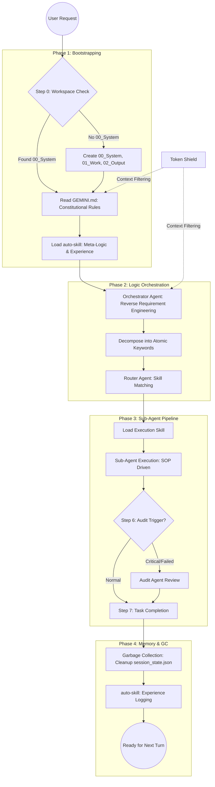

# MOSA Framework (Multi-Agent Orchestrated System Architecture) v2.5

MOSA is a high-performance, modular framework for AI coding assistants. It transforms a standard LLM into a sophisticated multi-agent system with constitutional logic, project memory, and an orchestrated skill-based pipeline.

---

## 🏗️ System Architecture & Workflow

The following diagram illustrates the lifecycle of a single task within the MOSA ecosystem:



---

## 🚀 Installation Guide

### Option 1: Native Antigravity / Agent OS (Recommended)
1.  **Skills Deployment**:
    - Copy the `skills/` folder to `~/.gemini/antigravity/skills/`.
    - Ensure `skills_registry.json` is in the root of the `skills/` directory.
2.  **Rule Integration**:
    - Place `GEMINI.md` and `AGENTS.md` in your workspace root.
3.  **Workspace Scaffold**:
    - Create the standard MOSA directories:
      ```bash
      mkdir 00_System 01_Work 02_Output
      ```
    - Copy templates from the bundle's `00_System/` to your new folder.

### Option 2: Generic LLM (Claude, Codex, ChatGPT)
1.  **Upload Framework**: Upload the `mosa-framework/` folder to the AI's current session.
2.  **Instruction Injection**: Start your conversation with:
    > "I am using the MOSA Framework. Please read `GEMINI.md` to understand your operational rules and use `skills/` as your toolset."
3.  **Memory Setup**: Ensure the AI has access to `00_System/prompt_stack.md` to track project progress.

---

## 🛠️ Core Features

### 1. Constitutional Logic (GEMINI.md)
A set of non-negotiable rules that govern how the AI interacts with the filesystem, handles tokens, and manages state. It ensures that the AI never acts "randomly" and always follows a strict SOP.

### 2. Token Shield Protocol
A mechanism that prevents the AI from "reading everything." By using `GRAPH_REPORT.md`, the AI understands the code structure *before* opening files, saving up to 50% of context window usage.

### 3. Orchestrated Execution
- **Orchestrator**: Acts as the Project Manager. It thinks before it acts.
- **Router**: Acts as the Librarian. It selects the exact specialized skill for the current task.
- **Sub-Agents**: Atomic execution units (Coder, Designer, Auditor) that focus on doing one thing perfectly.

### 4. Experience Persistence (`auto-skill`)
The framework learns from its mistakes. Every successful task completion triggers an "Experience Record" prompt, allowing the framework to build a local knowledge base specific to your project.

---

## 📝 Markdown Protocol (Project Structure)

MOSA relies on specific files for cross-turn memory:

| File | Purpose |
| :--- | :--- |
| `GEMINI.md` | **Global Constitution**. The rules of the game. |
| `AGENTS.md` | **Token Shield**. Query protocols for large projects. |
| `task.md` | **Live TODO List**. Located in `01_Work/` to track progress. |
| `prompt_stack.md` | **Long-term Memory**. Stores project goals and achievements. |
| `session_state.json`| **Short-term Memory**. Stores pointers and temp variables. |

---

## 🛡️ Privacy & Sanitization
The public version of MOSA has been **Sanitized**:
- ❌ No API Keys.
- ❌ No personal project history.
- ❌ No absolute file paths (Universal compatibility).
- ✅ Clean templates for all memory components.

---
**Build**: 2026-05-01 | **Architecture**: MOSA-L2.5
