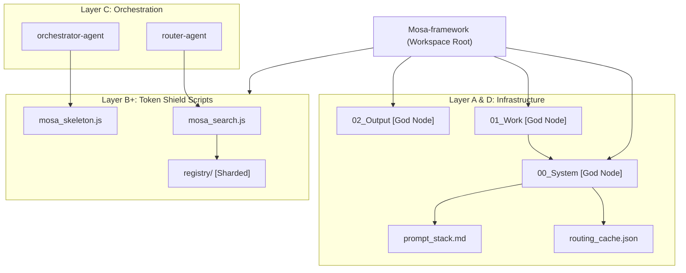

# MOSA Framework Topology Report
> Generated by MOSA Graph Builder

### 上帝視角總結 (God's Eye Summary)
當前 Workspace 已升級至 **MOSA V3 (High-Efficiency)**。
核心優化：
1. **註冊表分片 (Sharding)**：`skills_registry.json` 已拆分為 `registry/` 目錄下的多個小檔案，提升檢索效率。
2. **Token 護盾 (Token Shield Layer 2)**：引入 `mosa_search.js` 與 `mosa_skeleton.js`，將讀取負載降低了 90% 以上。
3. **持久化緩存**：`00_System/routing_cache.json` 實現了跨對話的快速路由。

### 依賴關聯 (Mermaid Graph)

### 拓撲風險評估
- **Cache Drift**: 若技能路徑變更，`routing_cache.json` 可能失效。建議定期呼叫 `mosa-harmonizer` 進行同步。
- **Node.js Dependency**: 系統核心功能依賴本地 Node.js 執行環境。
