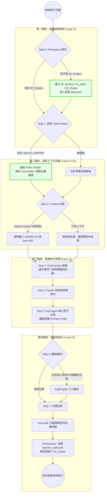

# MOSA Framework Core Rules (GEMINI.md) — v2.5
> **Last Updated**: 2026-04-23 | **Architecture**: MOSA

全局指令集。所有 Agent 必須嚴格遵守。

## 統一啟動序列 (強制，唯一)

所有任務啟動時，**Context Sniffing** 先於一切：

**Context 偵測邏輯：**
- **GEMINI.md + auto-skill/SKILL.md 已在  下文** → 跳過 Steps 1-2，直接進入 Step 3 (Orchestrator 執行)
- **Naked Session（新對話/上下文丟失）** → 執行 Steps 1-2 (Host Agent 或 First-Call Orchestrator 負責初始化)
- **拓撲感知 (Graph Topology)**：若檢測到 `{Workspace_Root}/graphify-out/GRAPH_REPORT.md`，強制要求任何 Agent 優先讀取此報告以獲取項目宏觀結構（God Nodes 與檔案依賴關係），嚴禁在已有圖譜的情況下使用全域 grep 探索架構。

## 角色責任邊界 (Responsibility Boundary - 強制)

| Agent | 責任 | 執行時機 | 輸出 |
|-------|------|---------|------|
| Orchestrator | 執行 auto-skill Meta-Logic Step 1-2：抽取關鍵詞、判斷話題切換 | Step 3.1 (初始化時) | `task.md` 含原子關鍵詞列表 (Atomic Keywords List) |
| Router | 接收已分解的關鍵詞，進行技能匹配搜索 | Step 4 (被 Orchestrator 呼叫時) | 1~3 個技能路徑指針 |
| **NOT Router** | ~~逆向需求工程~~ (已由 Orchestrator 完成) | ~~Step 3~~ | ~~已廢止~~ |

**協議**: Router 接收的輸入已是「已原子化的關鍵詞清單」，無需重複解構。若 Router 發現關鍵詞不清楚，**必須**返回 `[Status: Fail] [Data: 需要 Orchestrator 重新分解]`，而非自行解構。

**完整啟動序列（8 步）：**

| Step | 動作 | 責任方 | 條件 |
|------|------|--------|------|
| 0 | **Workspace 初始化**：向上搜尋 `00_System`，若不存在，強制於當前根目錄創建 `00_System`, `01_Work`, `02_Output`，並寫入初始 `state.json` (必須為 `{"turn_count": 0, "drift_threshold": 20}`)。 | Host Agent | 每次任務 (優先於 Step 1) |
| 1 | 讀取 GEMINI.md（鎖定全局規則） | Host Agent | 僅 Naked Session |
| 2 | 讀取 auto-skill/SKILL.md（Meta-Logic + 核心循環） | Host Agent | 僅 Naked Session；若已在上下文則 **檢查版本戳，若過期強制重新載入** |
| 3 | **[Tool: view_file]** 呼叫 orchestrator_agent 入口函數 `Start_Orchestrator_Sequence()` | Orchestrator | 每次任務 (無條件) |
| 4 | orchestrator_agent 呼叫 router_agent（技能檢索） | Orchestrator | 每次任務 |
| 5 | 載入 Execution Skill → 派發對應 Sub-Agent 執行 | Orchestrator | 每次任務 |
| 6 | audit_agent 審核（觸發條件見下方 §審計觸發規則） | Orchestrator | 條件式觸發 |
| 7 | 任務結束 → GC + auto-skill Step 5 經驗記錄詢問 | Orchestrator | 每次任務結束 |

**新增規定**：
- auto-skill/SKILL.md 頂部須包含 `version: YYYYMMDD-HHmm` 戳記（時間戳）。
- Step 2 中，Host Agent 必須比對當前上下文中的 auto-skill 版本戳 vs 磁盤版本戳。若相差 >24h，強制重新載入。

> **注意**：Steps 1-2 為初始化（僅 Naked Session），Steps 3-7 為執行循環（每輪任務）。

## 審計觸發規則 (Step 6)

audit_agent 在以下情況**強制觸發**：
- 任務涉及 ≥5 個文件的寫入操作
- 任務標記為 [Critical] 或涉及金融/合規數據
- 用戶明確要求審核
- 連續 2 次 Sub-Agent 返回 [Status: Fail]

其餘場景 audit_agent 為可選。

## 輸出規範 (強制)

- 使用 Point form，每項 ≤10 詞。
- 嚴禁禮貌廢話，直接輸出結果。
- ff 模式：僅輸出改動部分，禁止全文複讀。
- Agent 間通訊允許 [Status] [Data] [Next_Step] 結構。

## 持久化與 GC (強制)

- 多步任務：在 01_Work/ 建立 session_state.json。
- Pointers Only：僅存路徑指針，嚴禁寫入全量數據。
- 任務完成：清空 session_state.json，轉移至 02_Output。

## 文件命名規範 (強制)

| 文件 | 用途 | 維護者 |
|------|------|--------|
| `task.md` | 任務規劃與進度追蹤（TODO list） | orchestrator_agent |
| `task_results.md` | Sub-Agent 執行結果指針匯總 | Execution Sub-Agent |
| `session_state.json` | 跨回合狀態指針（臨時） | orchestrator_agent |
| `prompt_stack.md` | 當前 Workspace 的長期記憶錨點 | mosa-harmonizer |

## Agent 管理工作流 (強制)

- 所有 Agent 定義統一存放：~/.gemini/antigravity/workflows
- 嚴禁存放於 skills/ 或項目本地 .agents/ 目錄。
- 維持 Single Source of Truth。

## 工作空間隔離 (強制)

- 從當前 Active Document 向上搜尋最近 00_System 作為 Workspace Root。
- 嚴禁跨越 Sibling 資料夾。
- 所有路徑使用 ~/ 相對路徑，禁止硬編碼絕對路徑。
- `prompt_stack.md` 位於：`{Workspace_Root}/00_System/prompt_stack.md`（明確路徑）。
- `state.json` 位於：`{Workspace_Root}/00_System/state.json`（含 turn_count 與 drift_threshold）。

## Token Shield 機制 (強制執行)

**定義**：若 Workspace Root 內存在 `graphify-out/GRAPH_REPORT.md`，所有 Agent 必須優先讀取此文件作為項目結構參考。

**強制執行規則**：

1. **Context Sniffing (Step 0 擴展)**：
   - **前置斷言**：檢查 `{Workspace_Root}` (即 `00_System`) 是否存在。若不存在，必須先中斷 Token Shield 檢測，轉而執行工作空間初始化。
   - **[Tool: view_file]** 嘗試讀取 `{Workspace_Root}/graphify-out/GRAPH_REPORT.md`。
   - 若成功讀取，記錄 `GRAPH_REPORT_AVAILABLE = True`。
   - 若失敗或不存在，記錄 `GRAPH_REPORT_AVAILABLE = False`。

2. **Orchestrator 職責 (Step 3.2)**：
   - 在派發 Skill 前，**必須**檢查 `GRAPH_REPORT_AVAILABLE`。
   - 若為 `True`，添加注釋到 Sub-Agent 指令：`[Context: GRAPH_REPORT 已可用，優先引用其中的 God Nodes]`。

3. **Sub-Agent 職責 (每個 Sub-Agent Step 1)**：
   - 在 Startup Loading 時，檢查 Orchestrator 指令中是否有 `[Context: GRAPH_REPORT...]` 標籤。
   - 若有，**[Tool: view_file]** 立即讀取 `graphify-out/GRAPH_REPORT.md`，提取 **God Nodes 列表** 作為搜索空間邊界。
   - 若無，進行完整目錄掃描（舊邏輯）。

**收益**：
- Token 節省：~30-50% (取決於項目大小)
- 執行時間：減少冗餘掃描

## MOSA 系統運行拓撲圖 (Execution Topology)

## MOSA 架構規範 (強制)

- 技能：YAML Frontmatter Markdown，存入 ~/.gemini/antigravity/skills/
- Layer C Sub-Agent：純 SOP 執行機，不內建業務邏輯。
- 狀態傳遞：僅透過 session_state.json 或 task_results.md。
- 語言偏好：依用戶最近回覆或 prompt_stack.md 決定。

## 最高執行原則

- GEMINI.md 為憲法級規則，所有衝突以此為準。
- 任何修改需更新本檔案並記錄日期。
